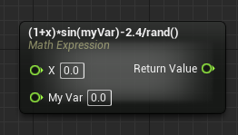

Easily forgotten feature of Blueprints. Math nodes can make Blueprints much more readable.

[Math Expression Node | Unreal Engine 4.27 Documentation | Epic Developer Community](https://dev.epicgames.com/documentation/en-us/unreal-engine/math-expression-node?application_version=4.27)
