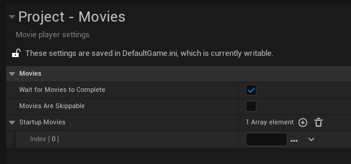

Intro movies can be added to the project using **Project -> Movies -> Startup Movies** array.

However, they may not play at all. This may be because the **Pre-Load Screen Movie Player** needs to be enabled.

